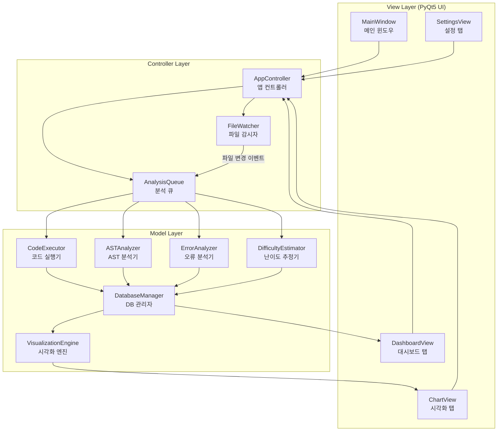
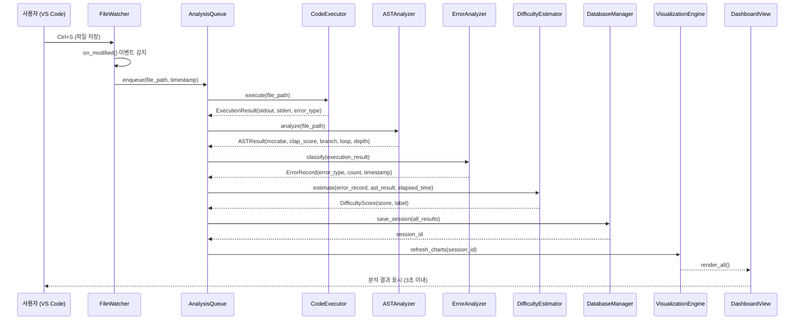
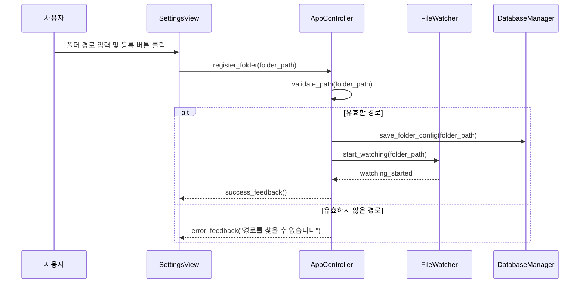

# 설계 문서: CLAP (Code Learning Analysis Program)

## 개요

CLAP(Code Learning Analysis Program)은 학생 개발자 및 주니어 개발자가 Python 코딩 학습 과정에서 발생하는 오류 패턴과 코드 복잡도를 자동으로 분석하여 시각적 피드백을 제공하는 에듀테크 데스크톱 애플리케이션입니다.

사용자가 지정한 학습 폴더를 실시간으로 감시하여, `.py` 파일이 저장될 때마다 자동으로 코드를 실행하고 오류를 수집하며, AST 기반 정적 분석을 통해 McCabe 순환 복잡도와 CLAP 자체 복잡도 점수를 산출합니다. 오류 빈도, 코드 복잡도, 풀이 시간을 종합한 학습 난이도 점수를 계산하고, 이를 matplotlib 기반 다양한 차트로 시각화하여 학습자가 자신의 성장 과정을 직관적으로 파악할 수 있도록 지원합니다.

외부 LLM API나 인터넷 연결 없이 로컬 환경에서 완전히 독립적으로 동작하며, Python 3.10 이상과 PyQt5가 설치된 Windows 환경에서 파일 저장 후 3초 이내에 분석 결과를 출력하는 것을 목표로 합니다. MVC 패턴을 기반으로 UI, 이벤트 처리, 데이터 분석 레이어를 명확히 분리하여 향후 Java, C 등 다른 언어 분석 모듈 추가가 용이한 확장 가능한 구조로 설계합니다.

## 아키텍처

CLAP은 MVC(Model-View-Controller) 패턴을 기반으로 세 레이어를 명확히 분리합니다.



## 시퀀스 다이어그램

### 메인 워크플로우: 파일 저장 → 분석 → 시각화



### 폴더 등록 워크플로우



## 컴포넌트 및 인터페이스

### View Layer

#### MainWindow

**목적**: 애플리케이션의 최상위 윈도우. 탭 기반 레이아웃으로 DashboardView, ChartView, SettingsView를 포함합니다.

**인터페이스**:
```python
class MainWindow(QMainWindow):
    def __init__(self, controller: AppController) -> None: ...
    def setup_ui(self) -> None: ...
    def show_notification(self, message: str, level: str = "info") -> None: ...
    def closeEvent(self, event: QCloseEvent) -> None: ...
```

**책임**:
- 탭 위젯 초기화 및 레이아웃 구성
- 애플리케이션 종료 시 FileWatcher 정리 및 DB 연결 종료
- 상태 표시줄에 분석 진행 상태 표시

---

#### DashboardView

**목적**: 최근 분석 결과 요약, 오류 목록, 난이도 점수를 실시간으로 표시합니다.

**인터페이스**:
```python
class DashboardView(QWidget):
    def __init__(self, controller: AppController) -> None: ...
    def refresh(self, session: AnalysisSession) -> None: ...
    def update_error_table(self, errors: list[ErrorRecord]) -> None: ...
    def update_difficulty_badge(self, score: DifficultyScore) -> None: ...
    def update_summary_stats(self, stats: SummaryStats) -> None: ...
```

**책임**:
- 최근 세션의 오류 유형별 카운트 테이블 표시
- 난이도 점수 및 레이블 배지 표시
- 누적 통계 요약 (총 세션 수, 평균 복잡도, 평균 난이도)

---

#### ChartView

**목적**: matplotlib 기반 6종 차트를 탭 또는 스크롤 레이아웃으로 표시합니다.

**인터페이스**:
```python
class ChartView(QWidget):
    def __init__(self, controller: AppController) -> None: ...
    def render_all(self, chart_data: ChartData) -> None: ...
    def render_error_bar(self, data: dict[str, int]) -> None: ...
    def render_activity_line(self, data: list[tuple[date, int]]) -> None: ...
    def render_mccabe_line(self, data: list[tuple[datetime, float]]) -> None: ...
    def render_clap_line(self, data: list[tuple[datetime, float]]) -> None: ...
    def render_difficulty_area(self, data: list[tuple[datetime, float]]) -> None: ...
    def render_error_pie(self, data: dict[str, int]) -> None: ...
```

**책임**:
- FigureCanvasQTAgg를 통해 matplotlib Figure를 PyQt5 위젯에 임베드
- 데이터 부족 시 "데이터가 충분하지 않습니다 (최소 5회 필요)" 안내 메시지 표시

---

#### SettingsView

**목적**: 학습 폴더 등록/해제, 데이터 초기화 기능을 제공합니다.

**인터페이스**:
```python
class SettingsView(QWidget):
    def __init__(self, controller: AppController) -> None: ...
    def get_folder_path(self) -> str: ...
    def show_registered_folders(self, folders: list[str]) -> None: ...
    def confirm_reset(self) -> bool: ...
```

---

### Controller Layer

#### AppController

**목적**: View와 Model 사이의 모든 이벤트를 중재합니다. View는 AppController만 참조하며, Model 클래스를 직접 호출하지 않습니다.

**인터페이스**:
```python
class AppController:
    def __init__(self, db: DatabaseManager) -> None: ...
    def register_folder(self, folder_path: str) -> Result[None, str]: ...
    def unregister_folder(self, folder_path: str) -> None: ...
    def on_file_changed(self, file_path: str) -> None: ...
    def get_dashboard_data(self) -> DashboardData: ...
    def get_chart_data(self) -> ChartData: ...
    def reset_all_data(self) -> None: ...
```

---

#### FileWatcher

**목적**: watchdog 라이브러리를 사용하여 등록된 폴더의 `.py` 파일 변경을 감지합니다.

**인터페이스**:
```python
class FileWatcher:
    def __init__(self, callback: Callable[[str], None]) -> None: ...
    def start_watching(self, folder_path: str) -> None: ...
    def stop_watching(self, folder_path: str) -> None: ...
    def stop_all(self) -> None: ...
```

**책임**:
- `watchdog.observers.Observer`와 `FileSystemEventHandler` 활용
- `.py` 확장자 파일의 `on_modified` 이벤트만 처리
- 중복 이벤트 방지를 위해 동일 파일 1초 이내 재이벤트 무시 (debounce)

---

#### AnalysisQueue

**목적**: 파일 변경 이벤트를 큐에 넣고 순차적으로 분석 파이프라인을 실행합니다.

**인터페이스**:
```python
class AnalysisQueue:
    def __init__(
        self,
        executor: CodeExecutor,
        ast_analyzer: ASTAnalyzer,
        error_analyzer: ErrorAnalyzer,
        difficulty_estimator: DifficultyEstimator,
        db: DatabaseManager,
        on_complete: Callable[[AnalysisSession], None]
    ) -> None: ...
    def enqueue(self, file_path: str, timestamp: datetime) -> None: ...
    def _process(self, file_path: str, timestamp: datetime) -> None: ...
```

**책임**:
- `threading.Thread`를 사용하여 분석을 백그라운드에서 실행 (UI 블로킹 방지)
- 분석 완료 후 `on_complete` 콜백으로 View 갱신 신호 전달
- 예외 발생 시 로그 기록 후 다음 항목 처리 계속

### Model Layer

#### CodeExecutor

**목적**: Python 파일을 서브프로세스로 실행하고 stdout, stderr, 오류 유형을 수집합니다.

**인터페이스**:
```python
class CodeExecutor:
    SUPPORTED_ERRORS: frozenset[str] = frozenset({
        "SyntaxError", "NameError", "TypeError",
        "IndentationError", "IndexError", "ValueError"
    })

    def execute(self, file_path: str, timeout: float = 10.0) -> ExecutionResult: ...
    def _parse_error_type(self, stderr: str) -> str | None: ...
```

**책임**:
- `subprocess.run(["python", file_path], capture_output=True, timeout=timeout)` 실행
- stderr에서 오류 유형 파싱 (정규식 기반)
- timeout 초과 시 `TimeoutExpired` 처리 후 `ExecutionResult(timed_out=True)` 반환
- UI 코드와 직접 결합 금지

---

#### ASTAnalyzer

**목적**: Python `ast` 모듈과 `radon` 라이브러리를 사용하여 코드 복잡도를 분석합니다.

**인터페이스**:
```python
class ASTAnalyzer:
    def analyze(self, source_code: str) -> ASTResult: ...
    def _compute_mccabe(self, source_code: str) -> float: ...
    def _compute_clap_score(self, tree: ast.AST) -> ClapComponents: ...
    def _count_branches(self, tree: ast.AST) -> int: ...
    def _count_loops(self, tree: ast.AST) -> int: ...
    def _max_nesting_depth(self, tree: ast.AST) -> int: ...
    def _total_function_length(self, tree: ast.AST) -> int: ...
```

**책임**:
- `radon.complexity.cc_visit()`으로 McCabe 순환 복잡도 산출
- CLAP 복잡도 공식 적용: `(branch × 1.0) + (loop × 1.2) + (depth × 1.5) + (func_len × 0.5)`
- SyntaxError 발생 시 `ASTResult(valid=False)` 반환
- UI 코드와 직접 결합 금지

---

#### ErrorAnalyzer

**목적**: `ExecutionResult`에서 오류 유형을 분류하고 DB 저장용 `ErrorRecord`를 생성합니다.

**인터페이스**:
```python
class ErrorAnalyzer:
    def classify(self, result: ExecutionResult, timestamp: datetime) -> ErrorRecord: ...
    def get_error_summary(self, session_id: int) -> dict[str, int]: ...
```

---

#### DifficultyEstimator

**목적**: 오류 빈도, 코드 복잡도, 풀이 시간을 종합하여 학습 난이도 점수를 산출합니다.

**인터페이스**:
```python
class DifficultyEstimator:
    def estimate(
        self,
        error_count: int,
        clap_score: float,
        elapsed_seconds: float,
        history: list[HistoricalSession]
    ) -> DifficultyScore: ...
    def _normalize(self, value: float, history_values: list[float]) -> float: ...
    def _label(self, score: float, normalized_error: float, normalized_complexity: float) -> str: ...
```

**책임**:
- 난이도 공식: `(normalized_error × 0.4) + (normalized_complexity × 0.3) + (normalized_time × 0.3)`
- 누적 데이터 5회 미만 시 McCabe 점수만 기반으로 단순 레이블 반환
- 5회 이상 시 사용자 누적 평균 대비 상대적 레이블 산출
- UI 코드와 직접 결합 금지

---

#### DatabaseManager

**목적**: SQLite3 데이터베이스의 모든 읽기/쓰기를 담당합니다.

**인터페이스**:
```python
class DatabaseManager:
    def __init__(self, db_path: str = "clap_data.db") -> None: ...
    def initialize_schema(self) -> None: ...
    def save_session(self, session: AnalysisSession) -> int: ...
    def get_sessions(self, limit: int = 100) -> list[AnalysisSession]: ...
    def get_error_counts(self) -> dict[str, int]: ...
    def get_folder_configs(self) -> list[str]: ...
    def save_folder_config(self, folder_path: str) -> None: ...
    def delete_folder_config(self, folder_path: str) -> None: ...
    def reset_all(self) -> None: ...
    def close(self) -> None: ...
```

**책임**:
- DB 쓰기 실패 시 트랜잭션 롤백
- `context manager` 패턴으로 연결 관리
- 스키마 초기화 (테이블 없을 시 자동 생성)

---

#### VisualizationEngine

**목적**: DatabaseManager에서 데이터를 조회하여 matplotlib Figure 객체를 생성합니다.

**인터페이스**:
```python
class VisualizationEngine:
    def __init__(self, db: DatabaseManager) -> None: ...
    def build_chart_data(self) -> ChartData: ...
    def _error_bar_data(self) -> dict[str, int]: ...
    def _activity_line_data(self) -> list[tuple[date, int]]: ...
    def _mccabe_line_data(self) -> list[tuple[datetime, float]]: ...
    def _clap_line_data(self) -> list[tuple[datetime, float]]: ...
    def _difficulty_area_data(self) -> list[tuple[datetime, float]]: ...
    def _error_pie_data(self) -> dict[str, int]: ...
```

## 데이터 모델

### 핵심 데이터 클래스

```python
from dataclasses import dataclass, field
from datetime import datetime, date
from typing import Optional

@dataclass
class ExecutionResult:
    """코드 실행 결과"""
    file_path: str
    stdout: str
    stderr: str
    error_type: Optional[str]       # None이면 정상 실행
    timed_out: bool = False
    elapsed_seconds: float = 0.0

    # 검증 규칙:
    # - error_type은 SUPPORTED_ERRORS 중 하나이거나 None
    # - elapsed_seconds >= 0.0

@dataclass
class ClapComponents:
    """CLAP 복잡도 구성 요소"""
    branch_count: int       # if/elif/else 분기 수
    loop_count: int         # for/while 루프 수
    nesting_depth: int      # 최대 중첩 깊이
    function_length: int    # 모든 함수의 총 라인 수

    @property
    def score(self) -> float:
        return (
            self.branch_count * 1.0
            + self.loop_count * 1.2
            + self.nesting_depth * 1.5
            + self.function_length * 0.5
        )

@dataclass
class ASTResult:
    """AST 분석 결과"""
    valid: bool
    mccabe_score: float = 0.0
    mccabe_label: str = ""          # "단순" | "중간" | "복잡"
    clap_components: Optional[ClapComponents] = None
    feedback_message: str = ""

    # 검증 규칙:
    # - valid=False이면 나머지 필드는 기본값
    # - mccabe_label: 0~10="단순", 11~20="중간", 21+="복잡"

@dataclass
class ErrorRecord:
    """오류 분류 결과"""
    error_type: Optional[str]       # None이면 오류 없음
    timestamp: datetime
    file_path: str

@dataclass
class DifficultyScore:
    """학습 난이도 추정 결과"""
    score: float                    # 0.0 ~ 1.0 정규화 값
    label: str                      # "쉬움" | "보통" | "평소보다 어려운 코드" | "매우 어려움"
    is_relative: bool               # True=누적 평균 대비, False=절대 기준

@dataclass
class AnalysisSession:
    """하나의 파일 저장 이벤트에 대한 전체 분석 결과"""
    id: Optional[int]               # DB 저장 후 할당
    file_path: str
    timestamp: datetime
    execution_result: ExecutionResult
    ast_result: ASTResult
    error_record: ErrorRecord
    difficulty_score: DifficultyScore

@dataclass
class HistoricalSession:
    """난이도 추정을 위한 과거 세션 요약"""
    error_count: int
    clap_score: float
    elapsed_seconds: float

@dataclass
class ChartData:
    """시각화 엔진이 View에 전달하는 차트 데이터 묶음"""
    error_bar: dict[str, int]
    activity_line: list[tuple[date, int]]
    mccabe_line: list[tuple[datetime, float]]
    clap_line: list[tuple[datetime, float]]
    difficulty_area: list[tuple[datetime, float]]
    error_pie: dict[str, int]
    has_enough_data: bool           # 세션 수 >= 5

@dataclass
class DashboardData:
    """대시보드 View에 전달하는 요약 데이터"""
    latest_session: Optional[AnalysisSession]
    total_sessions: int
    avg_mccabe: float
    avg_difficulty: float
    recent_errors: list[ErrorRecord]

@dataclass
class SummaryStats:
    total_sessions: int
    avg_mccabe: float
    avg_difficulty: float
```

### SQLite 스키마

```sql
-- 분석 세션 테이블
CREATE TABLE IF NOT EXISTS sessions (
    id              INTEGER PRIMARY KEY AUTOINCREMENT,
    file_path       TEXT    NOT NULL,
    timestamp       TEXT    NOT NULL,   -- ISO 8601 형식
    elapsed_seconds REAL    NOT NULL DEFAULT 0.0,
    error_type      TEXT,               -- NULL이면 오류 없음
    mccabe_score    REAL    NOT NULL DEFAULT 0.0,
    clap_score      REAL    NOT NULL DEFAULT 0.0,
    branch_count    INTEGER NOT NULL DEFAULT 0,
    loop_count      INTEGER NOT NULL DEFAULT 0,
    nesting_depth   INTEGER NOT NULL DEFAULT 0,
    function_length INTEGER NOT NULL DEFAULT 0,
    difficulty_score REAL   NOT NULL DEFAULT 0.0,
    difficulty_label TEXT   NOT NULL DEFAULT ''
);

-- 등록된 폴더 설정 테이블
CREATE TABLE IF NOT EXISTS folder_configs (
    id          INTEGER PRIMARY KEY AUTOINCREMENT,
    folder_path TEXT    NOT NULL UNIQUE,
    registered_at TEXT  NOT NULL    -- ISO 8601 형식
);

-- 인덱스: 날짜별 조회 성능 최적화
CREATE INDEX IF NOT EXISTS idx_sessions_timestamp ON sessions(timestamp);
CREATE INDEX IF NOT EXISTS idx_sessions_error_type ON sessions(error_type);
```

## 알고리즘 의사코드 및 형식 명세

### 알고리즘 1: 파일 분석 파이프라인 (`AnalysisQueue._process`)

```python
ALGORITHM _process(file_path: str, enqueue_time: datetime)
INPUT:  file_path - 분석할 .py 파일 경로
        enqueue_time - 큐에 등록된 시각 (풀이 시간 계산 기준)
OUTPUT: AnalysisSession (DB 저장 완료)

BEGIN
    # 전제조건: file_path는 존재하는 .py 파일
    ASSERT os.path.exists(file_path) AND file_path.endswith(".py")

    start_time = datetime.now()

    # 1단계: 코드 실행
    execution_result = CodeExecutor.execute(file_path, timeout=10.0)
    elapsed = (datetime.now() - enqueue_time).total_seconds()

    # 2단계: AST 분석 (SyntaxError여도 시도, 실패 시 valid=False)
    source_code = read_file(file_path)
    ast_result = ASTAnalyzer.analyze(source_code)

    # 3단계: 오류 분류
    error_record = ErrorAnalyzer.classify(execution_result, start_time)

    # 4단계: 난이도 추정
    history = DatabaseManager.get_sessions(limit=100)
    historical = [HistoricalSession(s.error_count, s.clap_score, s.elapsed) for s in history]
    difficulty = DifficultyEstimator.estimate(
        error_count = 1 if error_record.error_type else 0,
        clap_score  = ast_result.clap_components.score if ast_result.valid else 0.0,
        elapsed_seconds = elapsed,
        history     = historical
    )

    # 5단계: DB 저장 (트랜잭션)
    session = AnalysisSession(
        file_path=file_path, timestamp=start_time,
        execution_result=execution_result, ast_result=ast_result,
        error_record=error_record, difficulty_score=difficulty
    )
    session_id = DatabaseManager.save_session(session)

    # 후조건: session_id > 0 (DB 저장 성공)
    ASSERT session_id > 0

    # 6단계: UI 갱신 콜백 (메인 스레드로 전달)
    on_complete(session)

EXCEPTION:
    IF any exception occurs:
        log_error(exception)
        # 파이프라인 중단하지 않고 다음 항목 처리 계속
        CONTINUE
END
```

**전제조건**:
- `file_path`는 존재하는 `.py` 파일
- `DatabaseManager`가 초기화된 상태

**후조건**:
- `AnalysisSession`이 DB에 저장됨
- `on_complete` 콜백이 호출되어 UI가 갱신됨
- 예외 발생 시 로그만 기록하고 파이프라인 계속 실행

**루프 불변식**: 해당 없음 (순차 파이프라인)

---

### 알고리즘 2: CLAP 복잡도 계산 (`ASTAnalyzer._compute_clap_score`)

```python
ALGORITHM _compute_clap_score(tree: ast.AST) -> ClapComponents
INPUT:  tree - Python AST 루트 노드
OUTPUT: ClapComponents (branch_count, loop_count, nesting_depth, function_length)

BEGIN
    branch_count = 0
    loop_count = 0
    function_length = 0

    # 분기 카운트: If, IfExp 노드
    FOR node IN ast.walk(tree):
        IF isinstance(node, (ast.If, ast.IfExp)):
            branch_count += 1
        ELIF isinstance(node, (ast.For, ast.While)):
            loop_count += 1
        ELIF isinstance(node, ast.FunctionDef):
            # 함수 길이 = end_lineno - lineno + 1
            function_length += (node.end_lineno - node.lineno + 1)
    END FOR

    # 루프 불변식: 모든 방문한 노드에 대해 카운트가 정확히 누적됨

    # 최대 중첩 깊이 계산 (재귀 DFS)
    nesting_depth = _max_nesting_depth(tree)

    clap_score = (branch_count * 1.0) + (loop_count * 1.2)
                 + (nesting_depth * 1.5) + (function_length * 0.5)

    ASSERT clap_score >= 0.0

    RETURN ClapComponents(branch_count, loop_count, nesting_depth, function_length)
END

ALGORITHM _max_nesting_depth(node: ast.AST, current_depth: int = 0) -> int
INPUT:  node - AST 노드
        current_depth - 현재 중첩 깊이
OUTPUT: 최대 중첩 깊이 (int)

BEGIN
    NESTING_NODES = (ast.If, ast.For, ast.While, ast.With, ast.Try, ast.FunctionDef)

    IF isinstance(node, NESTING_NODES):
        current_depth += 1

    max_depth = current_depth

    FOR child IN ast.iter_child_nodes(node):
        child_depth = _max_nesting_depth(child, current_depth)
        max_depth = max(max_depth, child_depth)
    END FOR

    # 루프 불변식: max_depth >= current_depth (항상 현재 깊이 이상)
    ASSERT max_depth >= current_depth

    RETURN max_depth
END
```

**전제조건**:
- `tree`는 `ast.parse()`로 생성된 유효한 AST
- `ast.parse()` 실패 시 이 함수는 호출되지 않음

**후조건**:
- `clap_score >= 0.0`
- `nesting_depth >= 0`
- 모든 카운트는 음수가 아님

**루프 불변식**:
- `ast.walk` 루프: 방문한 모든 노드에 대해 카운트가 정확히 누적됨
- `_max_nesting_depth` 재귀: `max_depth >= current_depth` 항상 성립

---

### 알고리즘 3: 난이도 추정 (`DifficultyEstimator.estimate`)

```python
ALGORITHM estimate(
    error_count: int,
    clap_score: float,
    elapsed_seconds: float,
    history: list[HistoricalSession]
) -> DifficultyScore

INPUT:  error_count      - 현재 세션 오류 발생 횟수 (0 또는 1)
        clap_score       - 현재 세션 CLAP 복잡도 점수
        elapsed_seconds  - 파일 저장까지 걸린 시간 (초)
        history          - 과거 세션 목록
OUTPUT: DifficultyScore

BEGIN
    # 전제조건
    ASSERT error_count >= 0
    ASSERT clap_score >= 0.0
    ASSERT elapsed_seconds >= 0.0

    IF len(history) < 5:
        # 데이터 부족: McCabe 기반 단순 레이블만 반환
        # (McCabe 점수는 ASTResult에서 별도 전달)
        RETURN DifficultyScore(score=0.0, label="데이터 수집 중", is_relative=False)
    END IF

    # 정규화: 누적 평균 대비 z-score 방식
    hist_errors     = [h.error_count for h in history]
    hist_complexity = [h.clap_score for h in history]
    hist_times      = [h.elapsed_seconds for h in history]

    normalized_error      = _normalize(error_count, hist_errors)
    normalized_complexity = _normalize(clap_score, hist_complexity)
    normalized_time       = _normalize(elapsed_seconds, hist_times)

    # 루프 불변식: 각 정규화 값은 0.0 ~ 1.0 범위
    ASSERT 0.0 <= normalized_error <= 1.0
    ASSERT 0.0 <= normalized_complexity <= 1.0
    ASSERT 0.0 <= normalized_time <= 1.0

    difficulty = (normalized_error * 0.4) + (normalized_complexity * 0.3) + (normalized_time * 0.3)

    ASSERT 0.0 <= difficulty <= 1.0

    label = _label(difficulty, normalized_error, normalized_complexity)

    RETURN DifficultyScore(score=difficulty, label=label, is_relative=True)
END

ALGORITHM _normalize(value: float, history_values: list[float]) -> float
BEGIN
    mean = statistics.mean(history_values)
    stdev = statistics.stdev(history_values) if len(history_values) > 1 else 1.0

    IF stdev == 0.0:
        RETURN 0.5  # 모든 값이 동일한 경우 중간값 반환

    z = (value - mean) / stdev
    # sigmoid 함수로 0~1 범위로 변환
    normalized = 1.0 / (1.0 + math.exp(-z))

    RETURN normalized
END

ALGORITHM _label(score: float, norm_error: float, norm_complexity: float) -> str
BEGIN
    IF score >= 0.75:
        RETURN "매우 어려움"
    ELIF score >= 0.55 AND (norm_error > 0.6 OR norm_complexity > 0.6):
        RETURN "평소보다 어려운 코드"
    ELIF score >= 0.4:
        RETURN "보통"
    ELSE:
        RETURN "쉬움"
    END IF
END
```

**전제조건**:
- `error_count >= 0`, `clap_score >= 0.0`, `elapsed_seconds >= 0.0`
- `history`는 리스트 (빈 리스트 허용)

**후조건**:
- `history` 길이 < 5이면 `is_relative=False`인 결과 반환
- `history` 길이 >= 5이면 `0.0 <= score <= 1.0`이고 `is_relative=True`
- `label`은 "쉬움", "보통", "평소보다 어려운 코드", "매우 어려움", "데이터 수집 중" 중 하나

**루프 불변식**: 해당 없음 (순차 계산)

## 핵심 함수 형식 명세

### `CodeExecutor.execute()`

```python
def execute(self, file_path: str, timeout: float = 10.0) -> ExecutionResult:
    ...
```

**전제조건**:
- `file_path`는 존재하는 파일 경로 (`.py` 확장자)
- `timeout > 0.0`

**후조건**:
- 반환값은 항상 `ExecutionResult` 인스턴스 (예외 없음)
- 정상 실행: `result.error_type is None`
- 오류 발생: `result.error_type in SUPPORTED_ERRORS` 또는 `"UnknownError"`
- 타임아웃: `result.timed_out is True`
- `result.elapsed_seconds >= 0.0`

**루프 불변식**: 해당 없음

---

### `ASTAnalyzer.analyze()`

```python
def analyze(self, source_code: str) -> ASTResult:
    ...
```

**전제조건**:
- `source_code`는 문자열 (빈 문자열 허용)

**후조건**:
- `source_code`가 파싱 불가능하면 `result.valid is False`
- `result.valid is True`이면 `result.mccabe_score >= 0.0`
- `result.valid is True`이면 `result.clap_components is not None`
- `result.mccabe_label`은 "단순", "중간", "복잡" 중 하나 (valid=True일 때)
- `result.feedback_message`는 항상 비어있지 않은 문자열

**루프 불변식**: 해당 없음

---

### `DatabaseManager.save_session()`

```python
def save_session(self, session: AnalysisSession) -> int:
    ...
```

**전제조건**:
- `session.file_path`는 비어있지 않은 문자열
- `session.timestamp`는 유효한 `datetime` 객체
- DB 연결이 열려있는 상태

**후조건**:
- 성공 시 반환값 > 0 (자동 증가 ID)
- `session.id`가 반환값으로 설정됨
- DB 쓰기 실패 시 트랜잭션 롤백 후 예외 발생

**루프 불변식**: 해당 없음

---

## 사용 예시

### 예시 1: 기본 분석 파이프라인

```python
# 초기화
db = DatabaseManager("clap_data.db")
db.initialize_schema()

executor = CodeExecutor()
ast_analyzer = ASTAnalyzer()
error_analyzer = ErrorAnalyzer()
difficulty_estimator = DifficultyEstimator()

# 파일 분석 실행
file_path = "C:/학습폴더/solution.py"
timestamp = datetime.now()

# 1. 코드 실행
result = executor.execute(file_path, timeout=10.0)
print(f"오류 유형: {result.error_type}")  # 예: "NameError"

# 2. AST 분석
with open(file_path, encoding="utf-8") as f:
    source = f.read()
ast_result = ast_analyzer.analyze(source)
print(f"McCabe: {ast_result.mccabe_score}")  # 예: 7.0 → "단순"
print(f"CLAP: {ast_result.clap_components.score}")  # 예: 12.5

# 3. 난이도 추정
history = db.get_sessions(limit=100)
historical = [HistoricalSession(1 if s.error_type else 0, s.clap_score, s.elapsed_seconds)
              for s in history]
difficulty = difficulty_estimator.estimate(
    error_count=1 if result.error_type else 0,
    clap_score=ast_result.clap_components.score if ast_result.valid else 0.0,
    elapsed_seconds=result.elapsed_seconds,
    history=historical
)
print(f"난이도: {difficulty.label}")  # 예: "평소보다 어려운 코드"
```

### 예시 2: 폴더 등록 및 감시 시작

```python
# AppController를 통한 폴더 등록
controller = AppController(db)
result = controller.register_folder("C:/학습폴더")

if result.is_ok():
    print("폴더 등록 완료. 파일 감시 시작됨.")
else:
    print(f"오류: {result.error}")  # 예: "경로를 찾을 수 없습니다"

# 이후 C:/학습폴더/*.py 파일 저장 시 자동 분석 실행
```

### 예시 3: 시각화 데이터 조회

```python
viz_engine = VisualizationEngine(db)
chart_data = viz_engine.build_chart_data()

if chart_data.has_enough_data:
    # 오류 유형별 막대 그래프 데이터
    print(chart_data.error_bar)
    # 예: {"NameError": 5, "TypeError": 3, "SyntaxError": 2}

    # 난이도 변화 데이터
    for ts, score in chart_data.difficulty_area:
        print(f"{ts.strftime('%m/%d %H:%M')}: {score:.2f}")
else:
    print("데이터가 충분하지 않습니다 (최소 5회 필요)")
```

## 정확성 속성 (Correctness Properties)

*속성(Property)은 시스템의 모든 유효한 실행에서 참이어야 하는 특성 또는 동작입니다. 인간이 읽을 수 있는 명세와 기계가 검증할 수 있는 정확성 보장 사이의 다리 역할을 합니다.*

### 속성 1: 오류 유형은 지원 목록 내에 있거나 None

*임의의* Python 파일 실행 결과에 대해, ExecutionResult의 error_type은 반드시 None이거나 지원 오류 유형 집합(SyntaxError, NameError, TypeError, IndentationError, IndexError, ValueError, UnknownError) 중 하나여야 한다.

**검증 대상: 요구사항 3.2**

---

### 속성 2: 정상 실행 시 error_type은 None

*임의의* 오류 없이 정상 실행되는 Python 코드에 대해, CodeExecutor가 반환하는 ExecutionResult의 error_type은 반드시 None이어야 한다.

**검증 대상: 요구사항 3.3**

---

### 속성 3: AST 분석 결과의 수치 불변 속성

*임의의* 유효한 Python 소스 코드에 대해, ASTAnalyzer가 반환하는 ASTResult는 다음 불변 속성을 모두 만족해야 한다: (1) clap_components.score >= 0.0, (2) clap_components.nesting_depth >= 0, (3) clap_components.branch_count >= 0, (4) clap_components.loop_count >= 0.

**검증 대상: 요구사항 4.2**

---

### 속성 4: McCabe 레이블은 점수 범위와 일치

*임의의* 유효한 Python 소스 코드에 대해, ASTAnalyzer가 반환하는 mccabe_label은 mccabe_score 범위와 정확히 일치해야 한다: 점수 ≤ 10이면 "단순", 11 ≤ 점수 ≤ 20이면 "중간", 점수 ≥ 21이면 "복잡".

**검증 대상: 요구사항 4.3, 4.4, 4.5**

---

### 속성 5: 데이터 5회 미만 시 is_relative=False

*임의의* 길이가 5 미만인 히스토리 목록으로 DifficultyEstimator를 호출하면, 반환되는 DifficultyScore의 is_relative는 반드시 False이어야 한다.

**검증 대상: 요구사항 5.1**

---

### 속성 6: 정규화된 난이도 점수는 0~1 범위

*임의의* 길이가 5 이상인 히스토리 목록으로 DifficultyEstimator를 호출하면, 반환되는 DifficultyScore의 score는 반드시 0.0 이상 1.0 이하이어야 하고 is_relative는 True이어야 한다.

**검증 대상: 요구사항 5.2**

---

### 속성 7: 난이도 레이블은 정의된 집합 내에 있음

*임의의* 입력으로 DifficultyEstimator를 호출하면, 반환되는 DifficultyScore의 label은 반드시 {"쉬움", "보통", "평소보다 어려운 코드", "매우 어려움", "데이터 수집 중"} 집합 내에 있어야 한다.

**검증 대상: 요구사항 5.3, 5.4, 5.5, 5.6**

---

### 속성 8: 저장된 세션은 조회 가능 (저장-조회 왕복)

*임의의* 유효한 AnalysisSession에 대해, DatabaseManager.save_session()으로 저장한 후 get_sessions()를 호출하면 해당 세션이 반드시 결과 목록에 포함되어야 한다.

**검증 대상: 요구사항 6.3, 11.3**

---

### 속성 9: DB 쓰기 실패 시 데이터 무결성 유지

*임의의* 잘못된 세션 데이터로 DatabaseManager.save_session()이 실패하면, 실패 전후의 get_sessions() 결과 수가 동일해야 한다 (트랜잭션 롤백).

**검증 대상: 요구사항 6.4**

---

### 속성 10: AnalysisSession 직렬화 왕복

*임의의* 유효한 AnalysisSession 객체에 대해, DatabaseManager를 통해 저장한 후 조회하면 원본 객체와 모든 필드(file_path, timestamp, error_type, mccabe_score, clap_score, difficulty_score, difficulty_label 등)가 동등한 객체를 반환해야 한다.

**검증 대상: 요구사항 11.3**

---

### 속성 11: VisualizationEngine 차트 데이터 형식 불변 속성

*임의의* 세션 데이터가 저장된 DatabaseManager에 대해, VisualizationEngine.build_chart_data()가 반환하는 ChartData는 다음 불변 속성을 모두 만족해야 한다: (1) error_bar의 모든 값 ≥ 0, (2) activity_line의 모든 카운트 ≥ 0, (3) mccabe_line과 clap_line의 모든 점수 ≥ 0.0, (4) difficulty_area의 모든 점수는 0.0~1.0 범위.

**검증 대상: 요구사항 8.1, 8.2, 8.3, 8.4, 8.5, 8.6**

## 오류 처리

### 오류 시나리오 1: 잘못된 Python 코드 저장

**조건**: 사용자가 SyntaxError가 있는 `.py` 파일을 저장

**처리**:
- `CodeExecutor.execute()`가 `ExecutionResult(error_type="SyntaxError")` 반환
- `ASTAnalyzer.analyze()`가 `ASTResult(valid=False)` 반환 (파싱 불가)
- CLAP 복잡도 점수는 0.0으로 기록
- 오류 유형과 타임스탬프는 정상적으로 DB에 저장됨

**복구**: 파이프라인 계속 실행, 다음 파일 저장 이벤트 정상 처리

---

### 오류 시나리오 2: 코드 실행 타임아웃 (무한 루프 등)

**조건**: 실행 시간이 10초를 초과

**처리**:
- `subprocess.TimeoutExpired` 예외 캐치
- `ExecutionResult(timed_out=True, error_type="TimeoutError")` 반환
- 대시보드에 "실행 시간 초과" 메시지 표시

**복구**: 프로세스 강제 종료 후 파이프라인 계속

---

### 오류 시나리오 3: DB 쓰기 실패

**조건**: 디스크 공간 부족, 파일 잠금 등으로 SQLite 쓰기 실패

**처리**:
- `sqlite3.OperationalError` 캐치
- 트랜잭션 롤백 (`conn.rollback()`)
- 오류 로그 파일(`clap_error.log`)에 기록
- UI에 "데이터 저장 실패" 알림 표시

**복구**: 다음 분석 이벤트에서 재시도

---

### 오류 시나리오 4: 감시 중 폴더 삭제

**조건**: 등록된 폴더가 외부에서 삭제됨

**처리**:
- `watchdog`의 `DirDeletedEvent` 감지
- 해당 폴더의 Observer 자동 중지
- UI 상태 표시줄에 "폴더를 찾을 수 없습니다: {path}" 경고 표시
- DB의 `folder_configs`에서 해당 경로 제거

**복구**: 사용자가 SettingsView에서 새 폴더 재등록

---

### 오류 시나리오 5: 데이터 초기화 요청

**조건**: 사용자가 SettingsView에서 "데이터 초기화" 버튼 클릭

**처리**:
- 확인 팝업 표시: "모든 학습 데이터가 삭제됩니다. 계속하시겠습니까?"
- 사용자 확인 시: `DatabaseManager.reset_all()` 실행 (모든 테이블 데이터 삭제)
- 사용자 취소 시: 아무 동작 없음

**복구**: 초기화 후 빈 대시보드 표시

---

## 테스팅 전략

### 단위 테스트

각 Model 클래스는 독립적으로 테스트 가능합니다 (UI 코드와 결합 없음).

**`CodeExecutor` 테스트**:
```python
def test_execute_syntax_error():
    # SyntaxError 코드 파일 생성 후 실행
    result = executor.execute("test_syntax_error.py")
    assert result.error_type == "SyntaxError"

def test_execute_name_error():
    result = executor.execute("test_name_error.py")
    assert result.error_type == "NameError"

def test_execute_timeout():
    result = executor.execute("test_infinite_loop.py", timeout=1.0)
    assert result.timed_out is True

def test_execute_success():
    result = executor.execute("test_valid.py")
    assert result.error_type is None
```

**`ASTAnalyzer` 테스트**:
```python
def test_nesting_depth_3():
    # 중첩 깊이 3 이상 코드 → McCabe + CLAP 점수 정상 산출 확인
    code = """
def foo():
    for i in range(10):
        if i > 5:
            while True:
                break
"""
    result = ast_analyzer.analyze(code)
    assert result.valid is True
    assert result.clap_components.nesting_depth >= 3
    assert result.clap_components.score > 0.0
    assert result.mccabe_label in {"단순", "중간", "복잡"}

def test_syntax_error_code():
    result = ast_analyzer.analyze("def foo(: pass")
    assert result.valid is False
```

**`DifficultyEstimator` 테스트**:
```python
def test_insufficient_data():
    # 5회 미만 데이터 → is_relative=False
    score = estimator.estimate(1, 10.0, 300.0, history=[])
    assert score.is_relative is False
    assert score.label == "데이터 수집 중"

def test_hard_code_detection():
    # 5회 이상 데이터 누적 후 평균보다 오류 많고 복잡도 높은 코드
    history = [HistoricalSession(0, 5.0, 120.0) for _ in range(10)]
    score = estimator.estimate(
        error_count=1,      # 평균(0)보다 높음
        clap_score=20.0,    # 평균(5.0)보다 높음
        elapsed_seconds=600.0,
        history=history
    )
    assert score.is_relative is True
    assert score.label in {"평소보다 어려운 코드", "매우 어려움"}
```

### 속성 기반 테스트 (Property-Based Testing)

**테스트 라이브러리**: `hypothesis`

```python
from hypothesis import given, strategies as st

@given(
    branch=st.integers(min_value=0, max_value=100),
    loop=st.integers(min_value=0, max_value=100),
    depth=st.integers(min_value=0, max_value=50),
    func_len=st.integers(min_value=0, max_value=500)
)
def test_clap_score_always_non_negative(branch, loop, depth, func_len):
    """CLAP 점수는 항상 0 이상"""
    components = ClapComponents(branch, loop, depth, func_len)
    assert components.score >= 0.0

@given(
    error_count=st.integers(min_value=0, max_value=10),
    clap_score=st.floats(min_value=0.0, max_value=100.0),
    elapsed=st.floats(min_value=0.0, max_value=3600.0),
    history_size=st.integers(min_value=5, max_value=50)
)
def test_difficulty_score_in_range(error_count, clap_score, elapsed, history_size):
    """난이도 점수는 항상 0~1 범위"""
    history = [HistoricalSession(0, 5.0, 120.0) for _ in range(history_size)]
    score = estimator.estimate(error_count, clap_score, elapsed, history)
    assert 0.0 <= score.score <= 1.0

@given(st.text())
def test_ast_analyzer_never_raises(source_code):
    """ASTAnalyzer는 어떤 입력에도 예외를 발생시키지 않음"""
    result = ast_analyzer.analyze(source_code)
    assert isinstance(result, ASTResult)
```

### 통합 테스트

```python
def test_full_pipeline_with_error():
    """오류 있는 파일 → 전체 파이프라인 → DB 저장 확인"""
    # 6종 오류 각각에 대해 올바른 분류 및 DB 저장 확인
    for error_type in ["SyntaxError", "NameError", "TypeError",
                       "IndentationError", "IndexError", "ValueError"]:
        file_path = create_test_file(error_type)
        queue.enqueue(file_path, datetime.now())
        time.sleep(3.0)  # 3초 이내 완료 확인
        sessions = db.get_sessions(limit=1)
        assert sessions[0].error_type == error_type

def test_visualization_with_5_sessions():
    """5회 이상 세션 데이터 → 모든 그래프 정상 렌더링"""
    for _ in range(5):
        db.save_session(create_mock_session())
    chart_data = viz_engine.build_chart_data()
    assert chart_data.has_enough_data is True
    assert len(chart_data.mccabe_line) >= 5
    assert len(chart_data.difficulty_area) >= 5
```

## 성능 고려사항

- **분석 응답 시간**: 파일 저장 후 3초 이내 분석 결과 출력 목표. `AnalysisQueue`는 별도 스레드에서 실행하여 UI 블로킹 방지
- **파일 감시 debounce**: 동일 파일에 대한 1초 이내 중복 이벤트 무시하여 불필요한 분석 방지
- **코드 실행 타임아웃**: `subprocess.run(timeout=10.0)`으로 무한 루프 방지
- **DB 쿼리 최적화**: `timestamp`, `error_type` 컬럼에 인덱스 적용. 시각화 데이터 조회 시 최근 100개 세션만 로드
- **matplotlib 렌더링**: Figure 객체를 재사용하고 `clf()`로 초기화하여 메모리 누수 방지
- **메모리 목표**: RAM 4GB 이상 일반 교육용 PC에서 정상 동작. pandas DataFrame은 시각화 시에만 생성하고 즉시 해제

## 보안 고려사항

- **코드 실행 격리**: `subprocess.run()`으로 분석 대상 코드를 별도 프로세스에서 실행하여 메인 프로세스 보호
- **경로 검증**: 폴더 등록 시 `os.path.isdir()`로 유효성 검사, 경로 순회 공격 방지를 위해 절대 경로로 정규화
- **DB 인젝션 방지**: SQLite 쿼리에 파라미터 바인딩(`?` 플레이스홀더) 사용, 문자열 포맷팅 금지
- **로컬 독립 실행**: 외부 네트워크 통신 없음, 모든 데이터는 로컬 SQLite 파일에만 저장

## 의존성

| 패키지 | 버전 | 용도 |
|--------|------|------|
| Python | 3.10+ | 런타임 |
| PyQt5 | 5.15.x | GUI 프레임워크 |
| watchdog | 3.x | 파일 시스템 감시 |
| radon | 6.x | McCabe 순환 복잡도 계산 |
| matplotlib | 3.x | 데이터 시각화 |
| pandas | 2.x | 데이터 집계 및 변환 |
| numpy | 1.x | 수치 계산 (정규화) |
| hypothesis | 6.x | 속성 기반 테스트 (개발 의존성) |
| pytest | 7.x | 테스트 프레임워크 (개발 의존성) |

**표준 라이브러리 (별도 설치 불필요)**:
- `ast` - Python 코드 파싱
- `sqlite3` - 데이터베이스
- `subprocess` - 코드 실행
- `threading` - 백그라운드 분석
- `statistics` - 정규화 계산
- `math` - sigmoid 함수
- `logging` - 오류 로그 기록

## 프로젝트 디렉토리 구조

```
clap/
├── main.py                     # 애플리케이션 진입점
├── requirements.txt
├── clap_data.db                # SQLite DB (런타임 생성)
├── clap_error.log              # 오류 로그 (런타임 생성)
│
├── view/                       # View Layer
│   ├── __init__.py
│   ├── main_window.py          # MainWindow
│   ├── dashboard_view.py       # DashboardView
│   ├── chart_view.py           # ChartView
│   └── settings_view.py        # SettingsView
│
├── controller/                 # Controller Layer
│   ├── __init__.py
│   ├── app_controller.py       # AppController
│   ├── file_watcher.py         # FileWatcher
│   └── analysis_queue.py       # AnalysisQueue
│
├── model/                      # Model Layer
│   ├── __init__.py
│   ├── code_executor.py        # CodeExecutor
│   ├── ast_analyzer.py         # ASTAnalyzer
│   ├── error_analyzer.py       # ErrorAnalyzer
│   ├── difficulty_estimator.py # DifficultyEstimator
│   ├── database_manager.py     # DatabaseManager
│   └── visualization_engine.py # VisualizationEngine
│
├── data/                       # 데이터 클래스
│   ├── __init__.py
│   └── models.py               # 모든 dataclass 정의
│
└── tests/                      # 테스트
    ├── __init__.py
    ├── test_code_executor.py
    ├── test_ast_analyzer.py
    ├── test_error_analyzer.py
    ├── test_difficulty_estimator.py
    ├── test_database_manager.py
    └── test_integration.py
```
